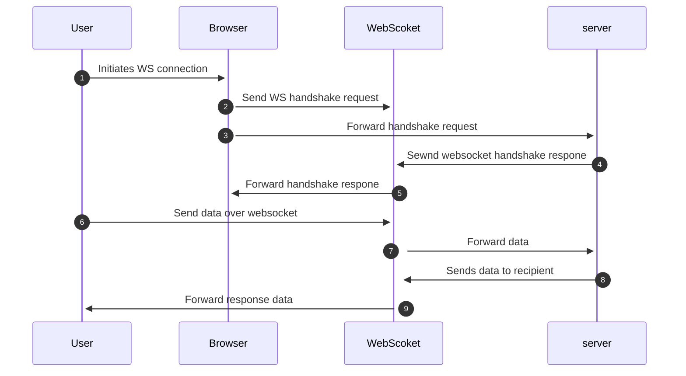
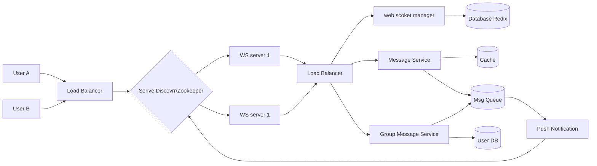

# Chat Application

Integrated chat component for organizers and participants in meetings, accessible on both organizer and participant frontends. Supports text content exclusively, with authentication for all users. Enables participants to view new messages without page reload.


https://github.com/TanveerAliS/chat-app-socket/assets/3439040/51783371-90b2-42c6-9062-5bb6f0755d5e


**Functional Requirements:**

- Send and receive text messages (excluding file attachments and multimedia content).
- User authentication for secure communication.
- Real-time message updates without page reloads.
- Accessible interfaces for both organizers and participants.
- Handle multiple simultaneous chat sessions for different meetings.

**Non-Functional Requirements:**

- Scalability to accommodate future growth in users and meetings.
- Low latency for message delivery (<100ms under high load).
- Unaffected page load times by the chat component.
- Access restriction to authorized participants.
- Intuitive and user-friendly chat interface.
- High availability and minimal downtime.
- System performance monitoring and error tracking.

**Technology Choices:**

- **Frontend:** Will be using React along with Tailwind.
- **Backend API:** Node.js with socket.io .
- **Authentication:** We will employ a [JWT](https://jwt.io/) service to generate tokens, which will then serve to authenticate users. (Assuming that the token is already stored in local storage or cookies for meetings.)

> **Note:** The RabbitMQ, Kafka, or Pusher based on desired features and scalability needs and Relational database like PostgreSQL or NoSQL database like MongoDB depending on data access patterns and volume.

## API Design

APIs for sending and retrieving messages within your chat application.

### 1. Sending a Message (POST /messages)

This API allows users to send text messages to other users.

**Request Parameters:**

- `sender_ID`: Unique identifier of the sender (e.g., phone number, username).
- `receiver_ID`: Unique identifier of the recipient (e.g., phone number, username).
- `text`: Content of the message.
  **Example:**

```
POST /messages
Content-Type: application/json
{
  "sender_ID": "+1234567890",
  "receiver_ID": "@johndoe",
  "type": "text",
  "text": "Hello, how are you?"
}
```

### 2. Retrieving Unread Messages (GET /messages/:user_id)

This API retrieves unread messages for a specific user.

**Request Parameter:**

- `user_id`: Unique identifier of the requesting user.

**Response:**

- Array of message objects containing sender, recipient, type, content, and other relevant information.

**Authentication:** Required for both sending and receiving messages.

## Archtechture and sequence diagrams

The chat system is broken down into three major categories: stateless services, stateful services, and third-party integration.

**Stateless services:** Stateless services handle public requests like login, profile, etc. (think load balancer + microservices). Many can be outsourced.  
**Stateful services:** Stateful chat service manages live connections for real-time updates. Clients stick to a server unless overloaded.  
**Push Notifications:** Third-party integration keeps users informed even when offline.

Traditional HTTP requests are inherently client-initiated, making it impossible for the server to directly push messages to clients. To overcome this limitation, we explore alternative approaches:

**1. Polling:**

- **Description:** Clients repeatedly send requests to the server at fixed intervals, inquiring about new data.
- **Pros:** Simple to implement, works with older browsers.
- **Cons:** Inefficient due to constant requests, creates unnecessary network traffic, high latency.

**2. Long Polling:**

- **Description:** Client sends a request and the server holds the connection open, waiting for new data. When data becomes available, the server sends it and closes the connection.
- **Pros:** Reduces traffic compared to polling, lowers latency when data arrives frequently.
- **Cons:** Still requires client initiation, inefficient for sporadic updates, server burden increases with connections.

**3. WebSockets:**

- **Description:** Establishes a persistent, bi-directional connection between client and server, enabling real-time communication. Messages can be freely exchanged from either side.
- **Pros:** Real-time updates, lowest latency, efficient with many clients, minimizes network traffic, single connection, widely supported.
- **Cons:** Slightly more complex implementation compared to polling, older browsers may require polyfills.

By leveraging the strengths of WebSockets, chat applications can achieve real-time communication, efficient resource utilization, and a superior user experience. This technology has become the cornerstone of modern chat applications, ensuring the smooth flow of information and fostering engaging interactions between users.



### Why WebSockets are the Superior Choice:

- **Real-time Communication:** WebSocket establishes a persistent, bi-directional connection between clients and the server, eliminating the need for constant polling or long polling. This translates to instant delivery of messages, creating a fluid and interactive chat experience.
- **Efficient Messaging:** By operating over a single TCP connection, WebSockets dramatically reduces overhead compared to alternatives like HTTP polling or long polling. This optimization minimizes resource consumption and enables efficient scaling of the chat application.
- **Universal Compatibility:** Supported by all major web browsers, WebSocket seamlessly integrates with any web application, ensuring wider accessibility and a consistent user experience across different platforms.

### WebSocket Communication Flow:

**Connection Establishment:** Both the sender and receiver initiate a WebSocket connection to the server.
**Message Sending:** The sender transmits a message to the server, which then relays it to the intended recipient.
**Message Receiving:** Conversely, the receiver sends messages through the server, ultimately reaching the sender.
**Real-time Interaction:** This persistent bi-directional channel facilitates seamless and timely communication between participants, fostering an engaging chat environment.

### Key Advantages for Chat Apps:

- **Continuous Connection:** Unlike traditional HTTP requests, which are short-lived and require repeated polling, WebSockets offer a persistent connection, enabling instant message delivery and eliminating unnecessary network traffic.
- **Reduced Overhead:** The single TCP connection significantly optimizes resource usage compared to numerous short-lived HTTP requests, ensuring efficient chat app performance even with high user engagement.
- **Enhanced User Experience:** The combination of real-time communication and efficient performance contributes to a more responsive and satisfying chat experience for users.
  And this will produce a flow chart:



## Service Discovery / Zookeeper

To efficiently handle millions of users across numerous WebSocket servers, we utilize service discovery. This process ensures each user connects to the optimal server based on pre-defined criteria.

Apache Zookeeper is a prevalent open-source service discovery tool. It maintains a registry of all active chat servers and selects the "best" server for each client based on factors like:

- **Geolocation:** Users connect to nearby servers for minimal latency.
- **Server Capacity:** Users are distributed evenly to avoid overloading any server.

**Client Connection Flow:**

1.  **User Login:** User initiates a login request.
2.  **Load Balancing:** The load balancer distributes the request to API servers.
3.  **Authentication:** Backend performs user authentication.
4.  **Service Discovery:** Zookeeper identifies the optimal server (e.g., Server 2) based on criteria.
5.  **Server Connection:** User establishes a WebSocket connection with Server 2.

**Benefits:**

- **Optimized Performance:** Users connect to the closest and least busy server, minimizing latency and maximizing responsiveness.
- **Scalability:** The system efficiently handles growth in users and servers.
- **Reduced Load:** Servers experience balanced workloads, preventing overload and ensuring smooth operation.

**Additional Notes:**

- Zookeeper dynamically updates server information, adapting to changing conditions.
- Users might be switched to different servers if performance or capacity demands dictate.

## Support for group messages

While WebSocket servers excel at live connections, meeting chat groups, with their blend of online and offline participants, require a different approach. Enter our messaging orchestra!

The Group Message Handler serves as the conductor, collecting information about group members and collaborating with the Group Message Service, our "group address book" that stores member details. Messages then travel through Kafka, a robust messenger queue guaranteeing real-time delivery even when users are offline.

Picture User A sending a message to their "Marketing Team" meeting chat group. The Handler grabs the message, the Service identifies online members, and Kafka swiftly carries the message away, stashing it for any offline recipients. Online members receive the message directly through their WebSocket servers, and Kafka deletes delivered messages.

To optimize performance, WebSocket servers can store recent member information, minimizing calls to the Service. This cached data stays up-to-date with regular refreshes, and push notifications ensure offline users are alerted when they return.

By harmonizing these components, we create a seamless meeting chat group experience, delivering messages effectively regardless of online status. It's a performance that keeps the conversation flowing, even when some members are stepping away!

# Resource Estimation

**Storage Capacity:** - Assuming 10KB per message (including metadata) and an average of 10 messages per hour per user, 10 participants per meeting, and 10,000 active users: - Daily storage per active user: 10KB/msg _ 10 msgs/hour _ 24 hours = 2.4 MB - Total daily storage for active users: 2.4 MB/user _ 10,000 users = 24 GB - Add buffer for inactive users and history retention: Multiply by a factor of 2-5 (e.g., 24 GB _ 3 = 72 GB)

**Bandwidth:** - Low concurrent users: Minimal bandwidth impact, estimate a few Megabits per second (Mbps). - High concurrent users: Scale linearly with user count (e.g., 10 concurrent users with 10KB/msg and 1 message/second each = 1 Mbps). -
**Number of Servers:**

- **Scalability is key:** Consider cloud solutions for dynamic scaling based on real-time demand.
- **Start small:** Begin with a few servers and monitor resource utilization.
- **Benchmarking:** Run tests with different scenarios to identify bottlenecks and scale efficiently.

**Additional Considerations:**

- **Data replication:** Factor in replication for redundancy and availability, potentially doubling storage needs.
- **Caching:** Implement caching strategies to reduce server load and bandwidth usage.
- **Compression:** Compress data to optimize storage and bandwidth efficiency.
- **Monitoring and Logging:** Continuously monitor resource usage and optimize as needed.
